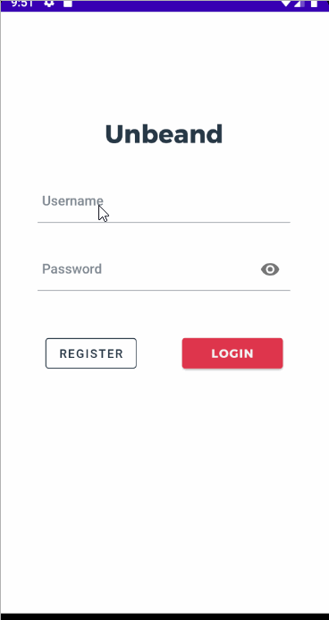

# Unbeaned

## Table of Contents
1. [Overview](#Overview)
1. [Product Spec](#Product-Spec)
1. [Wireframes](#Wireframes)
2. [Schema](#Schema)

## Overview
### Description
Our app is a coffee review, similar to a social media app. Users are able to like and share coffee shops that you enjoyed and leave reviews. They can also use their location to discover new coffee shops and see proximity on a map.

### App Evaluation
- **Category:** Food/Social
- **Mobile:** Use Google Maps, Camera App, Locations
- **Story:** Allows users to discover new coffee shops near them and share their opinions.
- **Market:** Coffee Lovers
- **Habit:** Users can use the app whenever in need of a new cafe or coffee shop location and want the opinions of other coffee lovers.
- **Scope:** Viewing nearby coffee shops and showing reviews from other users. We hope that eventually users can review drinks from coffee shops after exposure.

## Product Spec

### 1. User Stories (Required and Optional)

**Required Must-have Stories**

- [x] Show a list of cafes based off search
- [x] Obtain reviews and comments based off place
- [x] Display review images in Carousel view
- [ ] Obtain geographical information from user
- [ ] Show user profile with user info and their favorite places
- [ ] Show a map of the place with places to visit being displayed
- [x] Connect to Foursquare/Yelp API and query based on keywords
- [x] Ability for user to create an account
- [ ] Ability for users to save favorite places
- [ ] Ability to like places and write reviews
- [ ] Show nearby places in a search view

**Optional Nice-to-have Stories**

- [ ] Award users badges 
- [ ] Ability to have recommendations based on previously liked or recommended places.
- [ ] Recommender system that learns from previous choices
- [ ] Cache common requests reduce API calls

## Video Walkthrough

Here's a walkthrough of implemented user stories:

 

GIF created with [LiceCap](http://www.cockos.com/licecap/).

Plan for Next week:
Noah: Works on profile page and edit/logout profile page
Claudia: Compose activity reviews/comments, launch phone to call, launch google maps for directions, and work on implementing badges system
Timothy: Work on polishing UI/branding. autocomplete search, and possibly "explore page" 

### 2. Screen Archetypes

* Login/SignUp Screen
   * Ability to create an account
* Feed/Timeline Screen
   * Lists recommended places to visit based on geographical location
   * Connect to Foursquare/Yelp API and query based on keywords
   * Show similar places based on the currently viewed page
* Place detail View
    * Displays reviews (could be from Yelp or similar) of the place
    * Show place information through API
    * Cache commonly viewed details to reduce latency from API calls
* Search View
    * Displays closest places in a list with pictures or in a grid
* User Account
    * Displays user account, list of liked places, and options to change username and user information

### 3. Navigation

**Tab Navigation** (Tab to Screen)

* Search Places
* Nearby Places
* User Account

**Flow Navigation** (Screen to Screen)

* Login
   * Nearby Places
* Nearby Places
   * Detail Screens
       * Reviews Feed
       * Comments
   * Profile (from Reviews Card)
* User Page
    * Logout (to Login)
    * Detail Page of Reviews
    * Comments of reviews

## Wireframes

### [BONUS] Digital Wireframes & Mockups

### [BONUS] Interactive Prototype

## Schema 
### Models

### User
| Property | Type | Description |
| --- | --- | --- |
| objectId | String | An ID that is unique for each user |
| username | String | Display name for the app |
| password | String | Allows users to access account (private) |
| name | String | User's actual name |
| picture | File | User's profile picture |
| bio | String | A short description to get to know the user |
| reviewCount | Number | Keeps track of activity on the account |

### Review
| Property | Type | Description |
| --- | --- | --- |
| objectId | String | An Id unique to each post |
| userId | Pointer | User that created the post |
| placeId | String | A unique Id representing the place (from Foursquare/Yelp API) |
| rating | Number | Rating for the review |
| review | String | User's opinions |

### Images
| Property | Type | Description |
| --- | --- | --- |
| objectId | String | Unique ID for an uploaded image |
| reviewId | String | A reviewID to be fetched when showing a review |
| image | File | Image file of the image |

### Comments
| Property | Type | Description |
| --- | --- | --- |
| objectId | String | Unique ID for a comment |
| reviewId | String | A reviewId to be fetched when showing the comment under a review |
| userId | String | A userId to be fetched when showing user information in a review |

### Networking
- Feed
    * GET average ratings from user reviews of the place
    * GET from Yelp API for places
- Profile
    * GET username, picture, bio, reviews (text and images), comments
    * GET user reviews based on descending order of ratings
- Place Detail
    * GET place information, reviews (text and images), comments
    * GET user information for reviews and comments
    * POST review (text and upload images)
    * POST comments on reviews
- Review Detail
    * GET review (text and images), comments
    * GET user information
- Login
    * POST for option to SignUp
    * GET user login information for authentication
- [Create basic snippets for each Parse network request]
- [OPTIONAL: List endpoints if using existing API such as Yelp]
